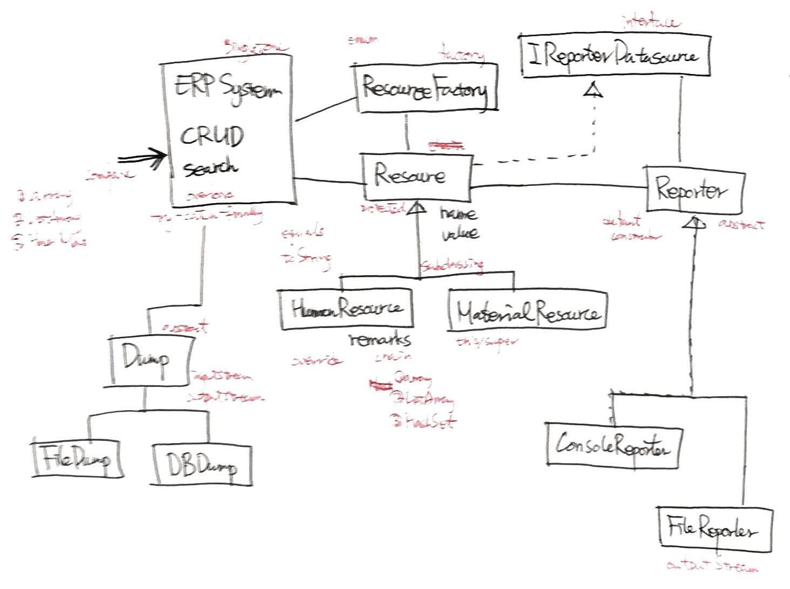

# Java Tutorial 1

**Project Name** : ERPSystem

**Class Diagram**

**Point**
- Syntax fundamental
- OOP fundamental
- Collection
- Design Pattern
- Swing
- File Handling
- Javadoc
- Packaging

**Features**
- Human/Material Resource infomation management
- Swing based GUI
- Backup using file system
- Report summary
- Report summary to file

**Site**
- [java class](bit.ly/java201507_class)